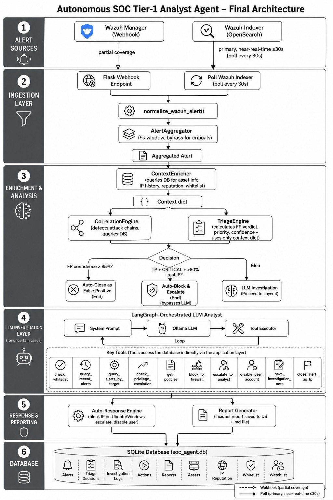

# Autonomous SOC Tier‑1 Analyst Agent

[](https://www.python.org/)

A **ReAct (Reasoning + Acting) AI agent** that operates as a fully autonomous **Tier‑1 Security Operations Centre (SOC) analyst**.  
It receives alerts from **Wazuh SIEM**, enriches them with context, correlates attack patterns, and makes evidence‑based decisions – closing false positives, blocking real threats, or escalating to a human.  
All backed by a local LLM (Ollama) and LangChain.

**Why this exists:**  
Alert fatigue is the #1 challenge in SOCs. This agent reduces **Mean Time to Detect (MTTD)** and **Mean Time to Respond (MTTR)** by automating the repetitive, high‑volume work of a Tier‑1 analyst. It never gets tired, never misses a pattern, and logs every decision for audit.

---

## Features

- 🚨 **Real‑time alert processing** – webhook or API polling from Wazuh.
- 📊 **Alert aggregation** – groups similar alerts from the same source IP to avoid LLM flooding.
- 🔍 **Context enrichment** – asset details, IP reputation (VirusTotal/AbuseIPDB cache), whitelist, and successful login detection.
- ⚖️ **Rule‑based triage engine** – computes False Positive probability and priority score **without an LLM**, instantly closing obvious false positives.
- 🔗 **Attack chain correlation** – recognises multi‑stage attacks (brute‑force → lateral movement) with MITRE ATT&CK mapping.
- 🧠 **LLM‑driven investigation (ReAct)** – a local Ollama model reasons, calls tools, and produces a final verdict.
- 🛡️ **Automatic response** – blocks IPs via Wazuh Active Response, disables compromised accounts, and creates escalation tickets.
- 📝 **Full audit trail** – every investigation step is logged to `investigations.log` and the database.
- 🧪 **Test mode** – mark IPs as “known malicious” to force immediate blocking for demonstrations.

---

## Architecture

<!-- Insert your architecture diagram here -->


---

## Prerequisites

- **Ubuntu 22.04** (or any Linux with Python 3.10+)
- **Wazuh 4.x** manager installed and API accessible
- **Ollama** running locally with a model (e.g., `gpt-oss:20b-cloud` or any model you pull)
- **Wazuh agents** on endpoints you want to protect
- **iptables** and the `firewall-drop` active‑response script on the Wazuh agents

---

## Quick Start (5 minutes)

1. Clone the repository and enter the folder:
   ```bash
   git clone https://github.com/YOUR_USERNAME/soc-analyst-agent.git
   cd soc-analyst-agent
   ```

2. Set up a virtual environment and install dependencies:
   ```bash
   python3 -m venv .venv
   source .venv/bin/activate
   pip install -r requirements.txt
   ```

3. Copy the example configuration and edit it with your settings:
   ```bash
   cp app_config.example.py app_config.py
   nano app_config.py          # fill in Wazuh URL/user/password, Ollama model, etc.
   ```

4. (Optional) Set a list of IPs you want to treat as known threats for testing:
   ```bash
   export KNOWN_MALICIOUS_IPS="192.168.56.105"
   ```

5. Start the agent:
   ```bash
   python main.py
   ```

6. Configure Wazuh to forward alerts to the agent’s webhook endpoint (see below).

The agent will now print a live feed of incoming alerts, triage results, and any LLM investigation steps.

---

## Detailed Setup

### 1. Wazuh API credentials
Edit `app_config.py` to point to your Wazuh manager:
```python
"wazuh_api": {
    "url":      "https://<manager-ip>:55000",
    "user":     "wazuh-wui",
    "password": "your-password",
}
```

### 2. Ollama
Make sure Ollama is installed and the desired model pulled:
```bash
ollama pull gpt-oss:20b-cloud   # or any other model
```
In `app_config.py`, set:
```python
"ollama": {
    "base_url": "http://localhost:11434",
    "model":    "gpt-oss:20b-cloud",
}
```

### 3. Active Response configuration (for blocking)
On each Wazuh agent (including the manager if it also acts as an endpoint), the `firewall-drop` command must be enabled.  
Edit `/var/ossec/etc/ossec.conf` and add **inside** the `<ossec_config>` block:
```xml
<active-response>
  <command>firewall-drop</command>
  <location>local</location>
  <level>16</level>   <!-- disable Wazuh's own automatic blocking -->
  <timeout>600</timeout>
</active-response>
```
Give the agent user permission to run `iptables`:
```bash
sudo visudo
# add:
wazuh ALL=(ALL) NOPASSWD: /usr/sbin/iptables, /usr/bin/iptables
```
Restart the Wazuh agent.

### 4. Forwarding alerts to the agent
**Option A – Wazuh Integration** (Wazuh 4.4+)  
In the manager’s `ossec.conf`, add:
```xml
<integration>
  <name>custom-soc-agent</name>
  <hook_url>http://<agent-ip>:5001/webhook</hook_url>
  <level>3</level>
  <alert_format>json</alert_format>
</integration>
```
**Option B – Polling**  
The agent already polls the Wazuh API every 30 seconds. No extra config needed.

---

## Configuration Reference

| Variable | Description | Default |
|----------|-------------|---------|
| `WAZUH_API_URL` | Wazuh manager API URL | `https://192.168.56.103:55000` |
| `WAZUH_USER` / `WAZUH_PASSWORD` | API credentials | (from app_config) |
| `OLLAMA_BASE_URL` | Ollama endpoint | `http://192.168.56.1:11434` |
| `OLLAMA_MODEL` | Model name | `gpt-oss:20b-cloud` |
| `KNOWN_MALICIOUS_IPS` | Force True Positive on these IPs | (empty) |
| `AGGREGATION_WINDOW` | Seconds to group alerts per source | `5` |
| `FP_AUTO_CLOSE` | FP probability threshold to auto‑close | `0.70` |
| `FP_UNCERTAIN` | Below this = True Positive | `0.40` |
| `PRIORITY_CRITICAL/HIGH/MEDIUM` | Priority score thresholds | `40/25/15` |

---

## How It Works

1. **Alerts arrive** via webhook or polling.  
2. The **normalizer** extracts source IP, target, rule, etc.  
3. The **aggregator** groups identical alerts from the same IP within a small window, keeping the highest severity one.  
4. The **context enricher** queries the local database for asset info, IP history, reputation cache, and recent login successes.  
5. The **triage engine** uses weighted indicators to:  
   - Estimate FP probability (0.0 = definite TP, 1.0 = definite FP)  
   - Compute a priority score (combining severity, asset criticality, threat intel, etc.)  
6. If FP probability > 85% **and** the IP is not a known test threat → alert auto‑closed.  
7. If the alert is a known test threat or triage returns high‑confidence True Positive + Critical priority → **IP blocked instantly**.  
8. Otherwise, the **LLM (ReAct) agent** investigates:  
   - It receives the alert, triage hints, and enriched context.  
   - It can call tools: `query_recent_alerts`, `check_successful_login`, `get_asset_info`, `check_ip_reputation`, `block_ip_firewall`, `escalate_to_analyst`, etc.  
   - It produces a final verdict with confidence, priority, and action.  
9. Every investigation is written to `investigations.log` and stored in the database.

---

## Testing a Brute‑Force Attack

1. From a test machine (e.g., Kali), run:
   ```bash
   hydra -l root -P /usr/share/wordlists/rockyou.txt ssh://192.168.56.103
   ```
2. Watch the agent console – you will see:  
   - Many low‑level alerts aggregated.  
   - When the successful login alert arrives (rule `40112`), the agent will either:  
     - Instantly block the IP (if `KNOWN_MALICIOUS_IPS` is set), **or**  
     - Invoke the LLM, which should recognise the compromise and call the block tool.
3. Verify the block:
   ```bash
   sudo iptables -L -n | grep 192.168.56.105
   ```
4. Check the audit log:
   ```bash
   cat investigations.log
   ```

---

## Project Structure

| File | Role |
|------|------|
| `Code/main.py` | Flask API, agent initialisation, alert pipeline |
| `Code/app_config.py` | Configuration loader (environment variables) |
| `Code/triage_engine.py` | Rule‑based FP probability and priority scoring |
| `Code/context_enricher.py` | Gathers asset info, IP history, reputation, etc. |
| `Code/correlation_engine.py` | Detects multi‑stage attack patterns |
| `Code/report_generator.py` | Produces human‑readable incident reports |
| `Code/db_manager.py` | SQLite database for alerts, assets, reputation |
| `Code/tools/wazuh_tools.py` | LLM tools: query alerts, reputation, whitelist, etc. |
| `Code/tools/block_tools.py` | LLM tools: block IP, disable user, escalate |
| `Code/tools/report_tools.py` | LLM tools: save notes, close as FP |
| `Code/policies.json` | Thresholds and escalation triggers |
| `Code/requirements.txt` | Python dependencies |
| `Code/investigations.log` | (generated) Full audit log of LLM investigations |

---

## Research / Paper

For a detailed explanation of the design, false‑positive reduction methodology, and performance benchmarks (MTTD/MTTR), see the accompanying paper:

📄 **[Agentic AI Security Supervisor](Research_Paper/Agentic_AI_Security_Supervisor.pdf)**

---

## Acknowledgements

- [Wazuh](https://wazuh.com/) for the open‑source SIEM
- [Ollama](https://ollama.com/) for local LLM hosting
- [LangChain](https://www.langchain.com/) for the ReAct agent framework
```
